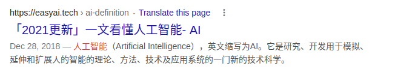
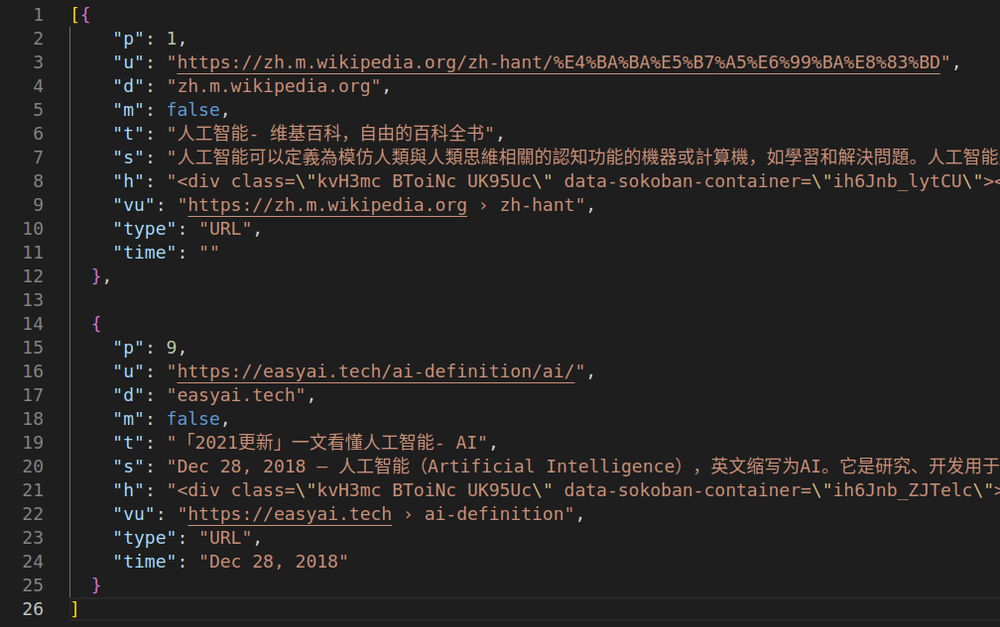

### 项目介绍

一个解析搜索引擎结果页面的 python 库.

项目地址: [github](https://github.com/chuangfengwang/search-parser)

支持功能

- 构造 google 搜索请求的 url: GoogleQuery
- 支持指定搜索时间范围: 不设定,过去一年,过去一月,过去一周,过去一天,过去一小时
- 支持取结果的第几页(从 0 开始编号)
- 支持提取结果的第几页, 下一页 url, 上一页 url
- 支持提取结果的字段见后文
- 提供一个 splash 请求代理

功能限制

- 仅支持 python3
- 目前仅支持 google 搜索结果解析
- 目前仅支持一般横条显示的内容解析,暂不支持地图类型,视频类型,图片类型,级联内容的解析

### 示例

搜索"人工智能"得到的两个结果以及解析出来的字段






### google-parser 使用方式

- 安装 python3 环境(可以用 virtualenv, conda 等)
- 下载本项目源码
- pip 安装 requirements.txt 里的依赖(`pip install -r requirements.txt`)
- 调用方式如下

```python
import json
from common import SplashAgent
from google_query import GoogleQuery
from google_parser import GoogleParser

# 首先安装 splash; 如有需要, 安装用于访问 google 的网络代理
# 代理地址配置
splash_html_url = 'http://127.0.0.1:8050/render.html'
splash_json_url = 'http://127.0.0.1:8050/render.json'
splash_execute_url = 'http://127.0.0.1:8050/execute'
splash_proxy = 'http://127.0.0.1:8118'  # splash 访问网页使用的代理

# splash 代理
splash_agent = SplashAgent(splash_url=splash_html_url, splash_proxy=splash_proxy)

query = '查询词,搜索框输入的内容'
time_select = 'y'  # '':不设定,默认,'y':过去一年,'m':过去一月,'w':过去一周,'d':过去一天,'h':过去一小时
page_num = 0  # 需要第几页结果,从 0 开始编号,默认 0
query_url = GoogleQuery(zone='com', query=query, tbs=time_select, start=page_num).get_url()

html = splash_agent.get_html(query_url)
parser = GoogleParser(html)
snippets = parser.get_snippets()

next_page_url = parser.get_next_page_url(query_url)  # 下一页 url
previous_page_url = parser.get_previous_page_url(query_url)  # 上一页 url
page_num = parser.get_current_page_num()  # 当前结果是第几页

for snippet in snippets:
    print(snippet.get('p'))  # 页面内第几个
    print(snippet.get('u'))  # 结果的 url
    print(snippet.get('d'))  # 结果的域名
    print(snippet.get('m'))  # 是不是地图类结果
    print(snippet.get('t'))  # 结果的标题
    print(snippet.get('s'))  # 结果的描述文本
    print(snippet.get('h'))  # 结果的 html
    print(snippet.get('vu'))  # 面包屑导航
    print(snippet.get('type'))  # 结果类型: PDF,URL
    print(snippet.get('time'))  # 结果也中显示的发布时间

print(json.dumps(snippets, ensure_ascii=False, indent=4))

# 获取下一页
html_next_page = splash_agent.get_html(next_page_url)

```

### google-parser 结果字段含义

```python
{
    'p': position,  # 页面内第几个
    'u': url,  # 结果的 url
    'd': cls._get_domain(url),  # 结果的域名
    'm': cls._is_map_snippet(url),  # 是不是地图类结果
    't': cls._get_title(title),  # 结果的标题
    's': cls._get_descr(snippet, url),  # 结果的描述文本
    'h': cls._get_html(snippet),  # 结果的 html 片段, 有对原html做过修改,如去除 script 标签等
    'vu': cls._get_vu(snippet),  # 面包屑导航
    'type': _get_type(snippet),  # 结果类型: PDF,URL 等
    'time': _get_type(time),  # 结果页中显示的发布时间,是结果页显示的形式,如: "Dec 28, 2018"
}
```

### json 结果样例如下

```json
[
  {
    "p": 1,
    "u": "https://zh.m.wikipedia.org/zh-hant/%E4%BA%BA%E5%B7%A5%E6%99%BA%E8%83%BD",
    "d": "zh.m.wikipedia.org",
    "m": false,
    "t": "人工智能- 维基百科，自由的百科全书",
    "s": "人工智能可以定義為模仿人類與人類思維相關的認知功能的機器或計算機，如學習和解決問題。人工智能是計算機科學的一個分支，它感知其環境並採取行動，最大限度地提高其成功 ...",
    "h": "<div class=\"kvH3mc BToiNc UK95Uc\" data-sokoban-container=\"ih6Jnb_lytCU\"><div class=\"Z26q7c UK95Uc uUuwM jGGQ5e\" data-header-feature=\"0\"><div class=\"yuRUbf\"><a data-jsarwt=\"1\" data-usg=\"AOvVaw0AEJKJCISnoz6-C5XGA1TX\" data-ved=\"2ahUKEwjopb2sqNr5AhX6tlYBHYWvBE8QFnoECAkQAQ\" href=\"https://zh.m.wikipedia.org/zh-hant/%E4%BA%BA%E5%B7%A5%E6%99%BA%E8%83%BD\"><br><h3 class=\"LC20lb MBeuO DKV0Md\">人工智能- 维基百科，自由的百科全书</h3><div class=\"TbwUpd NJjxre\"><cite class=\"iUh30 qLRx3b tjvcx\" role=\"text\">https://zh.m.wikipedia.org<span class=\"dyjrff qzEoUe\" role=\"text\"> › zh-hant</span></cite></div></a><div class=\"B6fmyf\"><div class=\"TbwUpd\"><cite class=\"iUh30 qLRx3b tjvcx\" role=\"text\">https://zh.m.wikipedia.org<span class=\"dyjrff qzEoUe\" role=\"text\"> › zh-hant</span></cite></div><div class=\"eFM0qc\"><span class=\"LAWljd\"> · </span><a class=\"fl iUh30\" data-jsarwt=\"1\" data-usg=\"AOvVaw0y6zqfTtr0GkNk9-3_7zTl\" data-ved=\"2ahUKEwjopb2sqNr5AhX6tlYBHYWvBE8Q7gF6BAgJEAU\" href=\"https://translate.google.com/translate?hl=en&sl=zh-TW&u=https://zh.m.wikipedia.org/zh-hant/%25E4%25BA%25BA%25E5%25B7%25A5%25E6%2599%25BA%25E8%2583%25BD&prev=search&pto=aue\"></a></div><div class=\"csDOgf\"><div data-isdesktop=\"true\" data-ved=\"2ahUKEwjopb2sqNr5AhX6tlYBHYWvBE8Q2esEegQICRAG\"><div><div aria-label=\"About this Result\" class=\"iTPLzd GUHazd lUn2nc eY4mx\" role=\"button\" style=\"padding-bottom:20px;padding-right:5px;position:absolute\" tabindex=\"0\"><span class=\"D6lY4c\"><span class=\"xTFaxe IjabWd z1asCe SaPW2b\" style=\"height:18px;line-height:18px;width:18px\"></span></span></div><span data-ved=\"2ahUKEwjopb2sqNr5AhX6tlYBHYWvBE8Qh-4GegQICRAH\"></span></div></div></div></div></div></div><div class=\"Z26q7c UK95Uc uUuwM\" data-content-feature=\"1\"><div class=\"VwiC3b yXK7lf MUxGbd yDYNvb lyLwlc lEBKkf\" style=\"-webkit-line-clamp:2\"><span><em>人工智能</em>可以定義為模仿人類與人類思維相關的認知功能的機器或計算機，如學習和解決問題。<em>人工智能</em>是計算機科學的一個分支，它感知其環境並採取行動，最大限度地提高其成功 ...</span></div></div><div class=\"Z26q7c UK95Uc uUuwM\" data-content-feature=\"2\" style=\"margin-top:5px;margin-bottom:5px\"><div class=\"IThcWe\" data-hveid=\"CA0QAA\"><div class=\"YgpRwf\"><div class=\"wFMWsc JCsJK OSrXXb\"><div class=\"rEYMH OSrXXb\"><span class=\"YrbPuc WGKbId BBwThe\">馬新: </span><span class=\"wHYlTd z8gr9e\">人工智能、人工智慧</span></div></div><div class=\"wFMWsc OSrXXb\"><div class=\"rEYMH OSrXXb\"><span class=\"YrbPuc WGKbId BBwThe\">日韓: </span><span class=\"wHYlTd z8gr9e\">人工知能</span></div></div></div></div></div><div class=\"Z26q7c UK95Uc\"><div data-ved=\"2ahUKEwjopb2sqNr5AhX6tlYBHYWvBE8Q2Z0BegQIAxAA\" id=\"eob_1\"></div></div></div></div></body></html>",
    "vu": "https://zh.m.wikipedia.org › zh-hant",
    "type": "URL",
    "time": ""
  },
  {
    "p": 2,
    "u": "https://www.netapp.com/zh-hant/artificial-intelligence/what-is-artificial-intelligence/",
    "d": "netapp.com",
    "m": false,
    "t": "什麼是人工智慧（即AI）？為什麼人工智慧很重要 - NetApp",
    "s": "人工智慧(AI) 是透過建立及應用內建於動態運算環境中的演算法，來模擬人類智慧過程的基礎。簡言之， AI 的目標是試圖讓電腦像人類一樣思考和行動。 實現這項目標需要三個 ...",
    "h": "<div class=\"kvH3mc BToiNc UK95Uc\" data-sokoban-container=\"ih6Jnb_QAFUae\"><div class=\"Z26q7c UK95Uc uUuwM jGGQ5e\" data-header-feature=\"0\"><div class=\"yuRUbf\"><a data-jsarwt=\"1\" data-usg=\"AOvVaw3jW8SPOYvbfsfdfIlc8Itz\" data-ved=\"2ahUKEwjopb2sqNr5AhX6tlYBHYWvBE8QFnoECAoQAQ\" href=\"https://www.netapp.com/zh-hant/artificial-intelligence/what-is-artificial-intelligence/\"><br><h3 class=\"LC20lb MBeuO DKV0Md\">什麼是人工智慧（即AI）？為什麼人工智慧很重要 - NetApp</h3><div class=\"TbwUpd NJjxre\"><cite class=\"iUh30 qLRx3b tjvcx\" role=\"text\">https://www.netapp.com<span class=\"dyjrff qzEoUe\" role=\"text\"> › zh-hant</span></cite></div></a><div class=\"B6fmyf\"><div class=\"TbwUpd\"><cite class=\"iUh30 qLRx3b tjvcx\" role=\"text\">https://www.netapp.com<span class=\"dyjrff qzEoUe\" role=\"text\"> › zh-hant</span></cite></div><div class=\"eFM0qc\"><span class=\"LAWljd\"> · </span><a class=\"fl iUh30\" data-jsarwt=\"1\" data-usg=\"AOvVaw1NafthMVt96imqAihIb8uD\" data-ved=\"2ahUKEwjopb2sqNr5AhX6tlYBHYWvBE8Q7gF6BAgKEAU\" href=\"https://translate.google.com/translate?hl=en&sl=zh-TW&u=https://www.netapp.com/zh-hant/artificial-intelligence/what-is-artificial-intelligence/&prev=search&pto=aue\"></a></div><div class=\"csDOgf\"><div data-isdesktop=\"true\" data-ved=\"2ahUKEwjopb2sqNr5AhX6tlYBHYWvBE8Q2esEegQIChAG\"><div><div aria-label=\"About this Result\" class=\"iTPLzd GUHazd lUn2nc eY4mx\" role=\"button\" style=\"padding-bottom:20px;padding-right:5px;position:absolute\" tabindex=\"0\"><span class=\"D6lY4c\"><span class=\"xTFaxe IjabWd z1asCe SaPW2b\" style=\"height:18px;line-height:18px;width:18px\"></span></span></div><span data-ved=\"2ahUKEwjopb2sqNr5AhX6tlYBHYWvBE8Qh-4GegQIChAH\"></span></div></div></div></div></div></div><div class=\"Z26q7c UK95Uc uUuwM\" data-content-feature=\"1\"><div class=\"VwiC3b yXK7lf MUxGbd yDYNvb lyLwlc lEBKkf\" style=\"-webkit-line-clamp:2\"><span><em>人工</em>智慧(AI) 是透過建立及應用內建於動態運算環境中的演算法，來模擬人類智慧過程的基礎。簡言之， AI 的目標是試圖讓電腦像人類一樣思考和行動。 實現這項目標需要三個 ...</span></div></div><div class=\"Z26q7c UK95Uc\"><div data-ved=\"2ahUKEwjopb2sqNr5AhX6tlYBHYWvBE8Q2Z0BegQIBRAA\" id=\"eob_3\"></div></div></div></div></body></html>",
    "vu": "https://www.netapp.com › zh-hant",
    "type": "URL",
    "time": ""
  },
  {
    "p": 3,
    "u": "https://baike.baidu.hk/item/%E4%BA%BA%E5%B7%A5%E6%99%BA%E8%83%BD/9180",
    "d": "baike.baidu.hk",
    "m": false,
    "t": "人工智能_百度百科",
    "s": "人工智能（Artificial Intelligence），英文縮寫為AI。它是研究、開發用於模擬、延伸和擴展人的智能的理論、方法、技術及應用系統的一門新的技術科學。人工智能是 ...",
    "h": "<div class=\"kvH3mc BToiNc UK95Uc\" data-sokoban-container=\"ih6Jnb_c553gc\"><div class=\"Z26q7c UK95Uc uUuwM jGGQ5e\" data-header-feature=\"0\"><div class=\"yuRUbf\"><a data-jsarwt=\"1\" data-usg=\"AOvVaw1cs98FQkhF3yCno8AwMCnO\" data-ved=\"2ahUKEwjopb2sqNr5AhX6tlYBHYWvBE8QFnoECAsQAQ\" href=\"https://baike.baidu.hk/item/%E4%BA%BA%E5%B7%A5%E6%99%BA%E8%83%BD/9180\"><br><h3 class=\"LC20lb MBeuO DKV0Md\">人工智能_百度百科</h3><div class=\"TbwUpd NJjxre\"><cite class=\"iUh30 qLRx3b tjvcx\" role=\"text\">https://baike.baidu.hk<span class=\"dyjrff qzEoUe\" role=\"text\"> › item › 人工...</span></cite></div></a><div class=\"B6fmyf\"><div class=\"TbwUpd\"><cite class=\"iUh30 qLRx3b tjvcx\" role=\"text\">https://baike.baidu.hk<span class=\"dyjrff qzEoUe\" role=\"text\"> › item › 人工...</span></cite></div><div class=\"eFM0qc\"><span class=\"LAWljd\"> · </span><a class=\"fl iUh30\" data-jsarwt=\"1\" data-usg=\"AOvVaw3hVCx8KFBNa1ZRIwH8bVZC\" data-ved=\"2ahUKEwjopb2sqNr5AhX6tlYBHYWvBE8Q7gF6BAgLEAU\" href=\"https://translate.google.com/translate?hl=en&sl=zh-TW&u=https://baike.baidu.hk/item/%25E4%25BA%25BA%25E5%25B7%25A5%25E6%2599%25BA%25E8%2583%25BD/9180&prev=search&pto=aue\"></a></div><div class=\"csDOgf\"><div data-isdesktop=\"true\" data-ved=\"2ahUKEwjopb2sqNr5AhX6tlYBHYWvBE8Q2esEegQICxAG\"><div><div aria-label=\"About this Result\" class=\"iTPLzd GUHazd lUn2nc eY4mx\" role=\"button\" style=\"padding-bottom:20px;padding-right:5px;position:absolute\" tabindex=\"0\"><span class=\"D6lY4c\"><span class=\"xTFaxe IjabWd z1asCe SaPW2b\" style=\"height:18px;line-height:18px;width:18px\"></span></span></div><span data-ved=\"2ahUKEwjopb2sqNr5AhX6tlYBHYWvBE8Qh-4GegQICxAH\"></span></div></div></div></div></div></div><div class=\"Z26q7c UK95Uc uUuwM\" data-content-feature=\"1\"><div class=\"VwiC3b yXK7lf MUxGbd yDYNvb lyLwlc lEBKkf\" style=\"-webkit-line-clamp:2\"><span><em>人工智能</em>（Artificial Intelligence），英文縮寫為AI。它是研究、開發用於模擬、延伸和擴展人的智能的理論、方法、技術及應用系統的一門新的技術科學。<em>人工智能</em>是 ...</span></div></div><div class=\"Z26q7c UK95Uc\"><div data-ved=\"2ahUKEwjopb2sqNr5AhX6tlYBHYWvBE8Q2Z0BegQIBhAA\" id=\"eob_4\"></div></div></div></div></body></html>",
    "vu": "https://baike.baidu.hk › item › 人工...",
    "type": "URL",
    "time": ""
  },
  {
    "p": 4,
    "u": "https://www.oracle.com/cn/artificial-intelligence/what-is-ai/",
    "d": "oracle.com",
    "m": false,
    "t": "人工智能(AI) 是什么| Oracle 中国",
    "s": "简单来说，人工智能(AI) 是指可模仿人类智能来执行任务，并基于收集的信息对自身进行迭代式改进的系统和机器。AI 具有多种形式。例如： ... AI 更多的是一种为超级思考和数据 ...",
    "h": "<div class=\"kvH3mc BToiNc UK95Uc\" data-sokoban-container=\"ih6Jnb_SDcg5c\"><div class=\"Z26q7c UK95Uc uUuwM jGGQ5e\" data-header-feature=\"0\"><div class=\"yuRUbf\"><a data-jsarwt=\"1\" data-usg=\"AOvVaw140pWOMYLzJL6Eflmn3F7G\" data-ved=\"2ahUKEwjopb2sqNr5AhX6tlYBHYWvBE8QFnoECAgQAQ\" href=\"https://www.oracle.com/cn/artificial-intelligence/what-is-ai/\"><br><h3 class=\"LC20lb MBeuO DKV0Md\">人工智能(AI) 是什么| Oracle 中国</h3><div class=\"TbwUpd NJjxre\"><cite class=\"iUh30 qLRx3b tjvcx\" role=\"text\">https://www.oracle.com<span class=\"dyjrff qzEoUe\" role=\"text\"> › what-is-ai</span></cite></div></a><div class=\"B6fmyf\"><div class=\"TbwUpd\"><cite class=\"iUh30 qLRx3b tjvcx\" role=\"text\">https://www.oracle.com<span class=\"dyjrff qzEoUe\" role=\"text\"> › what-is-ai</span></cite></div><div class=\"eFM0qc\"><span class=\"LAWljd\"> · </span><a class=\"fl iUh30\" data-jsarwt=\"1\" data-usg=\"AOvVaw0sHYNFwIPuUsbzvqDbFl8l\" data-ved=\"2ahUKEwjopb2sqNr5AhX6tlYBHYWvBE8Q7gF6BAgIEAU\" href=\"https://translate.google.com/translate?hl=en&sl=zh-CN&u=https://www.oracle.com/cn/artificial-intelligence/what-is-ai/&prev=search&pto=aue\"></a></div><div class=\"csDOgf\"><div data-isdesktop=\"true\" data-ved=\"2ahUKEwjopb2sqNr5AhX6tlYBHYWvBE8Q2esEegQICBAG\"><div><div aria-label=\"About this Result\" class=\"iTPLzd GUHazd lUn2nc eY4mx\" role=\"button\" style=\"padding-bottom:20px;padding-right:5px;position:absolute\" tabindex=\"0\"><span class=\"D6lY4c\"><span class=\"xTFaxe IjabWd z1asCe SaPW2b\" style=\"height:18px;line-height:18px;width:18px\"></span></span></div><span data-ved=\"2ahUKEwjopb2sqNr5AhX6tlYBHYWvBE8Qh-4GegQICBAH\"></span></div></div></div></div></div></div><div class=\"Z26q7c UK95Uc uUuwM\" data-content-feature=\"1\"><div class=\"VwiC3b yXK7lf MUxGbd yDYNvb lyLwlc lEBKkf\" style=\"-webkit-line-clamp:2\"><span>简单来说，<em>人工智能</em>(AI) 是指可模仿人类智能来执行任务，并基于收集的信息对自身进行迭代式改进的系统和机器。AI 具有多种形式。例如： ... AI 更多的是一种为超级思考和数据 ...</span></div></div><div class=\"Z26q7c UK95Uc\"><div data-ved=\"2ahUKEwjopb2sqNr5AhX6tlYBHYWvBE8Q2Z0BegQIBxAA\" id=\"eob_5\"></div></div></div></div></body></html>",
    "vu": "https://www.oracle.com › what-is-ai",
    "type": "URL",
    "time": ""
  },
  {
    "p": 5,
    "u": "https://aws.amazon.com/cn/machine-learning/what-is-ai/",
    "d": "aws.amazon.com",
    "m": false,
    "t": "什么是人工智能？_深度学习是什么？ - AWS 云服务",
    "s": "人工智能(AI) 是致力于解决通常与人工智能相关联的认知性问题的计算机科学领域，这些问题包括学习、问题解决和模式识别等。提起人工智能（通常缩写为“AI”），人们可能 ...",
    "h": "<div class=\"kvH3mc BToiNc UK95Uc\" data-sokoban-container=\"ih6Jnb_MDkvne\"><div class=\"Z26q7c UK95Uc uUuwM jGGQ5e\" data-header-feature=\"0\"><div class=\"yuRUbf\"><a data-jsarwt=\"1\" data-usg=\"AOvVaw2dm3IGPp8PsBqtDv7ZSW7o\" data-ved=\"2ahUKEwjopb2sqNr5AhX6tlYBHYWvBE8QFnoECAwQAQ\" href=\"https://aws.amazon.com/cn/machine-learning/what-is-ai/\"><br><h3 class=\"LC20lb MBeuO DKV0Md\">什么是人工智能？_深度学习是什么？ - AWS 云服务</h3><div class=\"TbwUpd NJjxre\"><cite class=\"iUh30 qLRx3b tjvcx\" role=\"text\">https://aws.amazon.com<span class=\"dyjrff qzEoUe\" role=\"text\"> › what-is-ai</span></cite></div></a><div class=\"B6fmyf\"><div class=\"TbwUpd\"><cite class=\"iUh30 qLRx3b tjvcx\" role=\"text\">https://aws.amazon.com<span class=\"dyjrff qzEoUe\" role=\"text\"> › what-is-ai</span></cite></div><div class=\"eFM0qc\"><span class=\"LAWljd\"> · </span><a class=\"fl iUh30\" data-jsarwt=\"1\" data-usg=\"AOvVaw3W1EFzOcRRJfywbFzIsSpE\" data-ved=\"2ahUKEwjopb2sqNr5AhX6tlYBHYWvBE8Q7gF6BAgMEAU\" href=\"https://translate.google.com/translate?hl=en&sl=zh-CN&u=https://aws.amazon.com/cn/machine-learning/what-is-ai/&prev=search&pto=aue\"></a></div><div class=\"csDOgf\"><div data-isdesktop=\"true\" data-ved=\"2ahUKEwjopb2sqNr5AhX6tlYBHYWvBE8Q2esEegQIDBAG\"><div><div aria-label=\"About this Result\" class=\"iTPLzd GUHazd lUn2nc eY4mx\" role=\"button\" style=\"padding-bottom:20px;padding-right:5px;position:absolute\" tabindex=\"0\"><span class=\"D6lY4c\"><span class=\"xTFaxe IjabWd z1asCe SaPW2b\" style=\"height:18px;line-height:18px;width:18px\"></span></span></div><span data-ved=\"2ahUKEwjopb2sqNr5AhX6tlYBHYWvBE8Qh-4GegQIDBAH\"></span></div></div></div></div></div></div><div class=\"Z26q7c UK95Uc uUuwM\" data-content-feature=\"1\"><div class=\"VwiC3b yXK7lf MUxGbd yDYNvb lyLwlc lEBKkf\" style=\"-webkit-line-clamp:2\"><span><em>人工智能</em>(AI) 是致力于解决通常与<em>人工智能</em>相关联的认知性问题的计算机科学领域，这些问题包括学习、问题解决和模式识别等。提起<em>人工智能</em>（通常缩写为“AI”），人们可能 ...</span></div></div><div class=\"Z26q7c UK95Uc\"><div data-ved=\"2ahUKEwjopb2sqNr5AhX6tlYBHYWvBE8Q2Z0BegQIBBAA\" id=\"eob_2\"></div></div></div></div></body></html>",
    "vu": "https://aws.amazon.com › what-is-ai",
    "type": "URL",
    "time": ""
  },
  {
    "p": 6,
    "u": "https://www.hpe.com/cn/zh/what-is/artificial-intelligence.html",
    "d": "hpe.com",
    "m": false,
    "t": "什么是人工智能(AI)？ | 词汇表| 慧与",
    "s": "从广义上来说，人工智能(AI) 是指机器或系统所呈现的任何模拟人类的行为。最基本的AI 形式是对计算机进行编程，使它们能够根据从过去类似行为中收集的海量数据来“模拟” ...",
    "h": "<div class=\"kvH3mc BToiNc UK95Uc\" data-sokoban-container=\"ih6Jnb_x0xOAd\"><div class=\"Z26q7c UK95Uc uUuwM jGGQ5e\" data-header-feature=\"0\"><div class=\"yuRUbf\"><a data-jsarwt=\"1\" data-usg=\"AOvVaw273qD-dVfSOvX9M-2mz9B1\" data-ved=\"2ahUKEwjopb2sqNr5AhX6tlYBHYWvBE8QFnoECCcQAQ\" href=\"https://www.hpe.com/cn/zh/what-is/artificial-intelligence.html\"><br><h3 class=\"LC20lb MBeuO DKV0Md\">什么是人工智能(AI)？ | 词汇表| 慧与</h3><div class=\"TbwUpd NJjxre\"><cite class=\"iUh30 qLRx3b tjvcx\" role=\"text\">https://www.hpe.com<span class=\"dyjrff qzEoUe\" role=\"text\"> › what-is › artif...</span></cite></div></a><div class=\"B6fmyf\"><div class=\"TbwUpd\"><cite class=\"iUh30 qLRx3b tjvcx\" role=\"text\">https://www.hpe.com<span class=\"dyjrff qzEoUe\" role=\"text\"> › what-is › artif...</span></cite></div><div class=\"eFM0qc\"><span class=\"LAWljd\"> · </span><a class=\"fl iUh30\" data-jsarwt=\"1\" data-usg=\"AOvVaw2htsZhKMIQf9SLOUOwfp6u\" data-ved=\"2ahUKEwjopb2sqNr5AhX6tlYBHYWvBE8Q7gF6BAgnEAU\" href=\"https://translate.google.com/translate?hl=en&sl=zh-CN&u=https://www.hpe.com/cn/zh/what-is/artificial-intelligence.html&prev=search&pto=aue\"></a></div><div class=\"csDOgf\"><div data-isdesktop=\"true\" data-ved=\"2ahUKEwjopb2sqNr5AhX6tlYBHYWvBE8Q2esEegQIJxAG\"><div><div aria-label=\"About this Result\" class=\"iTPLzd GUHazd lUn2nc eY4mx\" role=\"button\" style=\"padding-bottom:20px;padding-right:5px;position:absolute\" tabindex=\"0\"><span class=\"D6lY4c\"><span class=\"xTFaxe IjabWd z1asCe SaPW2b\" style=\"height:18px;line-height:18px;width:18px\"></span></span></div><span data-ved=\"2ahUKEwjopb2sqNr5AhX6tlYBHYWvBE8Qh-4GegQIJxAH\"></span></div></div></div></div></div></div><div class=\"Z26q7c UK95Uc uUuwM\" data-content-feature=\"1\"><div class=\"VwiC3b yXK7lf MUxGbd yDYNvb lyLwlc lEBKkf\" style=\"-webkit-line-clamp:2\"><span>从广义上来说，<em>人工智能</em>(AI) 是指机器或系统所呈现的任何模拟人类的行为。最基本的AI 形式是对计算机进行编程，使它们能够根据从过去类似行为中收集的海量数据来“模拟” ...</span></div></div><div class=\"Z26q7c UK95Uc\"><div data-ved=\"2ahUKEwjopb2sqNr5AhX6tlYBHYWvBE8Q2Z0BegQIIBAA\" id=\"eob_8\"></div></div></div></div></body></html>",
    "vu": "https://www.hpe.com › what-is › artif...",
    "type": "URL",
    "time": ""
  },
  {
    "p": 7,
    "u": "https://www.sas.com/zh_cn/insights/analytics/what-is-artificial-intelligence.html",
    "d": "sas.com",
    "m": false,
    "t": "人工智能–它是什么，它为什么重要 - SAS",
    "s": "人工智能(AI) 让机器可以从经验中学习，适应新的输入并像人一样完成任务。您今天所听说到的大多数AI 示例–从下国际象棋的计算机到自动驾驶汽车–都十分依赖深度学习和 ...",
    "h": "<div class=\"kvH3mc BToiNc UK95Uc\" data-sokoban-container=\"ih6Jnb_RNJgYd\"><div class=\"Z26q7c UK95Uc uUuwM jGGQ5e\" data-header-feature=\"0\"><div class=\"yuRUbf\"><a data-jsarwt=\"1\" data-usg=\"AOvVaw3I8tqhfATivTJci9xB4b_Q\" data-ved=\"2ahUKEwjopb2sqNr5AhX6tlYBHYWvBE8QFnoECCYQAQ\" href=\"https://www.sas.com/zh_cn/insights/analytics/what-is-artificial-intelligence.html\"><br><h3 class=\"LC20lb MBeuO DKV0Md\">人工智能–它是什么，它为什么重要 - SAS</h3><div class=\"TbwUpd NJjxre\"><cite class=\"iUh30 qLRx3b tjvcx\" role=\"text\">https://www.sas.com<span class=\"dyjrff qzEoUe\" role=\"text\"> › ... › 分析</span></cite></div></a><div class=\"B6fmyf\"><div class=\"TbwUpd\"><cite class=\"iUh30 qLRx3b tjvcx\" role=\"text\">https://www.sas.com<span class=\"dyjrff qzEoUe\" role=\"text\"> › ... › 分析</span></cite></div><div class=\"eFM0qc\"><span class=\"LAWljd\"> · </span><a class=\"fl iUh30\" data-jsarwt=\"1\" data-usg=\"AOvVaw0_JwimT4A52Xr9xH6QRgTE\" data-ved=\"2ahUKEwjopb2sqNr5AhX6tlYBHYWvBE8Q7gF6BAgmEAU\" href=\"https://translate.google.com/translate?hl=en&sl=zh-CN&u=https://www.sas.com/zh_cn/insights/analytics/what-is-artificial-intelligence.html&prev=search&pto=aue\"></a></div><div class=\"csDOgf\"><div data-isdesktop=\"true\" data-ved=\"2ahUKEwjopb2sqNr5AhX6tlYBHYWvBE8Q2esEegQIJhAG\"><div><div aria-label=\"About this Result\" class=\"iTPLzd GUHazd lUn2nc eY4mx\" role=\"button\" style=\"padding-bottom:20px;padding-right:5px;position:absolute\" tabindex=\"0\"><span class=\"D6lY4c\"><span class=\"xTFaxe IjabWd z1asCe SaPW2b\" style=\"height:18px;line-height:18px;width:18px\"></span></span></div><span data-ved=\"2ahUKEwjopb2sqNr5AhX6tlYBHYWvBE8Qh-4GegQIJhAH\"></span></div></div></div></div></div></div><div class=\"Z26q7c UK95Uc uUuwM\" data-content-feature=\"1\"><div class=\"VwiC3b yXK7lf MUxGbd yDYNvb lyLwlc lEBKkf\" style=\"-webkit-line-clamp:2\"><span><em>人工智能</em>(AI) 让机器可以从经验中学习，适应新的输入并像人一样完成任务。您今天所听说到的大多数AI 示例–从下国际象棋的计算机到自动驾驶汽车–都十分依赖深度学习和 ...</span></div></div><div class=\"Z26q7c UK95Uc\"><div data-ved=\"2ahUKEwjopb2sqNr5AhX6tlYBHYWvBE8Q2Z0BegQIHxAA\" id=\"eob_7\"></div></div></div></div></body></html>",
    "vu": "https://www.sas.com › ... › 分析",
    "type": "URL",
    "time": ""
  },
  {
    "p": 8,
    "u": "https://www.trendmicro.com/zh_hk/what-is/machine-learning/artificial-intelligence.html",
    "d": "trendmicro.com",
    "m": false,
    "t": "甚麼是人工智能？ - Trend Micro",
    "s": "現時有兩個主要方法利用電腦、機器、程式及源碼的決策及解決問題能力來模擬人類思維與本能，包括人性化方法及理想化方法。 人工智能; 人性化方法; 理性方法 ...",
    "h": "<div class=\"kvH3mc BToiNc UK95Uc\" data-sokoban-container=\"ih6Jnb_h0sUmf\"><div class=\"Z26q7c UK95Uc uUuwM jGGQ5e\" data-header-feature=\"0\"><div class=\"yuRUbf\"><a data-jsarwt=\"1\" data-usg=\"AOvVaw3K6LDGo-ngye0YwQE2KdHr\" data-ved=\"2ahUKEwjopb2sqNr5AhX6tlYBHYWvBE8QFnoECCUQAQ\" href=\"https://www.trendmicro.com/zh_hk/what-is/machine-learning/artificial-intelligence.html\"><br><h3 class=\"LC20lb MBeuO DKV0Md\">甚麼是人工智能？ - Trend Micro</h3><div class=\"TbwUpd NJjxre\"><cite class=\"iUh30 qLRx3b tjvcx\" role=\"text\">https://www.trendmicro.com<span class=\"dyjrff qzEoUe\" role=\"text\"> › what-is</span></cite></div></a><div class=\"B6fmyf\"><div class=\"TbwUpd\"><cite class=\"iUh30 qLRx3b tjvcx\" role=\"text\">https://www.trendmicro.com<span class=\"dyjrff qzEoUe\" role=\"text\"> › what-is</span></cite></div><div class=\"eFM0qc\"><span class=\"LAWljd\"> · </span><a class=\"fl iUh30\" data-jsarwt=\"1\" data-usg=\"AOvVaw2J2p06TEH2e4SdSOp0Y0E4\" data-ved=\"2ahUKEwjopb2sqNr5AhX6tlYBHYWvBE8Q7gF6BAglEAU\" href=\"https://translate.google.com/translate?hl=en&sl=zh-TW&u=https://www.trendmicro.com/zh_hk/what-is/machine-learning/artificial-intelligence.html&prev=search&pto=aue\"></a></div><div class=\"csDOgf\"><div data-isdesktop=\"true\" data-ved=\"2ahUKEwjopb2sqNr5AhX6tlYBHYWvBE8Q2esEegQIJRAG\"><div><div aria-label=\"About this Result\" class=\"iTPLzd GUHazd lUn2nc eY4mx\" role=\"button\" style=\"padding-bottom:20px;padding-right:5px;position:absolute\" tabindex=\"0\"><span class=\"D6lY4c\"><span class=\"xTFaxe IjabWd z1asCe SaPW2b\" style=\"height:18px;line-height:18px;width:18px\"></span></span></div><span data-ved=\"2ahUKEwjopb2sqNr5AhX6tlYBHYWvBE8Qh-4GegQIJRAH\"></span></div></div></div></div></div></div><div class=\"Z26q7c UK95Uc uUuwM\" data-content-feature=\"1\"><div class=\"VwiC3b yXK7lf MUxGbd yDYNvb lyLwlc lEBKkf\" style=\"-webkit-line-clamp:2\"><span>現時有兩個主要方法利用電腦、機器、程式及源碼的決策及解決問題能力來模擬人類思維與本能，包括人性化方法及理想化方法。 <em>人工智能</em>; 人性化方法; 理性方法 ...</span></div></div><div class=\"Z26q7c UK95Uc\"><div data-ved=\"2ahUKEwjopb2sqNr5AhX6tlYBHYWvBE8Q2Z0BegQIHhAA\" id=\"eob_6\"></div></div></div></div></body></html>",
    "vu": "https://www.trendmicro.com › what-is",
    "type": "URL",
    "time": ""
  },
  {
    "p": 9,
    "u": "https://easyai.tech/ai-definition/ai/",
    "d": "easyai.tech",
    "m": false,
    "t": "「2021更新」一文看懂人工智能- AI",
    "s": "Dec 28, 2018 — 人工智能（Artificial Intelligence），英文缩写为AI。它是研究、开发用于模拟、延伸和扩展人的智能的理论、方法、技术及应用系统的一门新的技术科学。",
    "h": "<div class=\"kvH3mc BToiNc UK95Uc\" data-sokoban-container=\"ih6Jnb_ZJTelc\"><div class=\"Z26q7c UK95Uc uUuwM jGGQ5e\" data-header-feature=\"0\"><div class=\"yuRUbf\"><a data-jsarwt=\"1\" data-usg=\"AOvVaw3FZ8XTiOsvYBmRPoJ6GW_w\" data-ved=\"2ahUKEwjopb2sqNr5AhX6tlYBHYWvBE8QFnoECCsQAQ\" href=\"https://easyai.tech/ai-definition/ai/\"><br><h3 class=\"LC20lb MBeuO DKV0Md\">「2021更新」一文看懂人工智能- AI</h3><div class=\"TbwUpd NJjxre\"><cite class=\"iUh30 qLRx3b tjvcx\" role=\"text\">https://easyai.tech<span class=\"dyjrff qzEoUe\" role=\"text\"> › ai-definition</span></cite></div></a><div class=\"B6fmyf\"><div class=\"TbwUpd\"><cite class=\"iUh30 qLRx3b tjvcx\" role=\"text\">https://easyai.tech<span class=\"dyjrff qzEoUe\" role=\"text\"> › ai-definition</span></cite></div><div class=\"eFM0qc\"><span class=\"LAWljd\"> · </span><a class=\"fl iUh30\" data-jsarwt=\"1\" data-usg=\"AOvVaw3vhncHkPiexrafA_7wVoAx\" data-ved=\"2ahUKEwjopb2sqNr5AhX6tlYBHYWvBE8Q7gF6BAgrEAU\" href=\"https://translate.google.com/translate?hl=en&sl=zh-CN&u=https://easyai.tech/ai-definition/ai/&prev=search&pto=aue\"></a></div><div class=\"csDOgf\"><div data-isdesktop=\"true\" data-ved=\"2ahUKEwjopb2sqNr5AhX6tlYBHYWvBE8Q2esEegQIKxAG\"><div><div aria-label=\"About this Result\" class=\"iTPLzd GUHazd lUn2nc eY4mx\" role=\"button\" style=\"padding-bottom:20px;padding-right:5px;position:absolute\" tabindex=\"0\"><span class=\"D6lY4c\"><span class=\"xTFaxe IjabWd z1asCe SaPW2b\" style=\"height:18px;line-height:18px;width:18px\"></span></span></div><span data-ved=\"2ahUKEwjopb2sqNr5AhX6tlYBHYWvBE8Qh-4GegQIKxAH\"></span></div></div></div></div></div></div><div class=\"Z26q7c UK95Uc uUuwM\" data-content-feature=\"1\"><div class=\"VwiC3b yXK7lf MUxGbd yDYNvb lyLwlc lEBKkf\" style=\"-webkit-line-clamp:2\"><span class=\"MUxGbd wuQ4Ob WZ8Tjf\"><span>Dec 28, 2018</span> — </span><span><em>人工智能</em>（Artificial Intelligence），英文缩写为AI。它是研究、开发用于模拟、延伸和扩展人的智能的理论、方法、技术及应用系统的一门新的技术科学。</span></div></div><div class=\"Z26q7c UK95Uc\"><div data-ved=\"2ahUKEwjopb2sqNr5AhX6tlYBHYWvBE8Q2Z0BegQIJBAA\" id=\"eob_9\"></div></div></div></div></body></html>",
    "vu": "https://easyai.tech › ai-definition",
    "type": "URL",
    "time": "Dec 28, 2018"
  }
]
```

### known bugs

项目采用了正则, PyQuery, Beautiful Soup, Scrapy Selector 多种提取方式

后期希望逐渐淘汰 PyQuery 和 Scrapy Selector 方式, 将主要使用 Beautiful Soup 解析.

### 致谢

本项目简化了这个的项目, 且部分数据和代码来源于此, 并适配了 python3: [google-parser](https://github.com/KokocGroup/google-parser)
